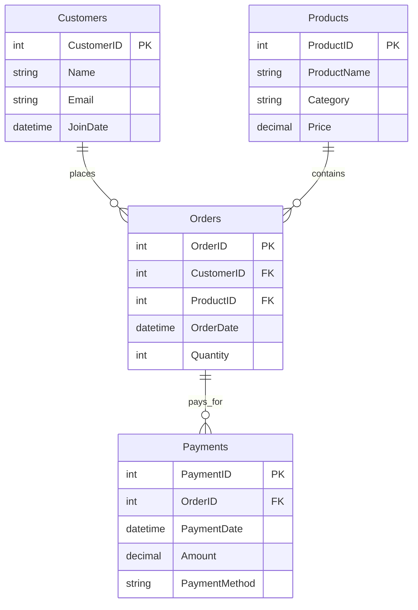

# Part 2: Database Management Task

## 1. Database Design Explanation

The database is designed to act as a basic Order Management System using a normalized Relational Database Management System (RDBMS) approach.

### Tables
- **Customers**: Stores customer profile information. `CustomerID` is the primary key.
- **Products**: Stores the catalog of items. `ProductID` is the primary key.
- **Orders**: A simplified transaction table. It links a Customer to a Product.
    - **Design Decision**: To strictly adhere to the requirement of using only 4 specific tables (Customers, Orders, Products, Payments), the `Orders` table acts as both the order header and the order line item. It links `CustomerID` and `ProductID` directly. In a more complex real-world scenario, an `OrderDetails` table would be used to allow multiple products per single Order ID, but this design satisfies the constraints while maintaining referential integrity.
- **Payments**: Tracks payments made against orders. `PaymentID` is the primary key and it references `Orders`.

### Relationships
- **Customers 1 : N Orders**: One customer can place multiple orders.
- **Products 1 : N Orders**: One product can be ordered many times.
- **Orders 1 : N Payments**: An order can theoretically have multiple payments (e.g., partial payments), though for simplicity we assume 1:1 in sample data.

## 2. ER Diagram

## 3. Purpose of Each Query

1.  **Fetch top 3 customers with the highest number of orders**:
    *   **Purpose**: To identify the most frequent buyers.
    *   **Logic**: Joins Customers and Orders, counts the number of OrderIDs per customer, and sorts in descending order, taking the top 3.

2.  **Retrieve orders placed in the last 30 days**:
    *   **Purpose**: To view recent sales activity.
    *   **Logic**: Filters the Orders table where the `OrderDate` is greater than or equal to the current date minus 30 days.

3.  **Calculate total revenue for each product**:
    *   **Purpose**: To analyze product performance.
    *   **Logic**: Joins Products and Orders, calculates revenue per line (Price * Quantity), sums it up by Product, and orders by highest revenue.
